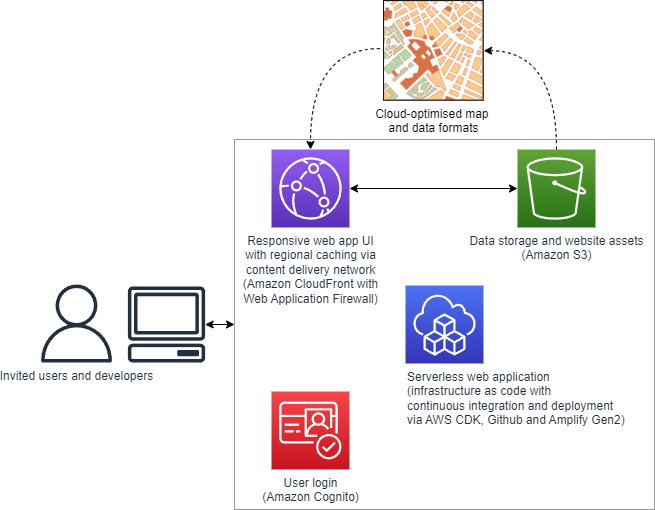

# jibe-vis
Interactive visualisation app for exploring health impacts of urban planning scenarios based on large-scale transport and health simulation modelling.

## Status
Prototype illustrating potential functionality that we could implement in an interactive tool to make transport and health modelling results from JIBE and similar projects accessible and useful. Through our engagement with stakeholders, we will incorporate and test new functionality that can help meet their needs and achieve this goal. Current at time of writing, 14 June 2024).



## Project structure

```
diagrams/ # Folder containing JIBE-Vis architecture and concept diagrams
app/ # Folder containing the JIBE-Vis web application
├── amplify/ # Folder containing AWS CDK and Amplify backend configuration
│   ├── auth/ # Definition for authentication backend
│   │   └── resource.tsx
│   ├── storage/ # Definition for your storage backend
│   │   └── resource.ts
|   ├── backend.ts # Orchestration of backend infrastructure
├── src/ # React framework UI code
│   ├── components/ # Definition of discrete UI components (e.g. navbar and map)
│   ├── App.tsx # UI code
│   ├── index.css # Styling for your app
│   └── index.tsx # Application entry point
├── package.json # Project metadata file describing dependencies and script running
└── tsconfig.json # Configuration of TypeScript code compilation
```

This project uses the Node create-react-app template (), using the [Vite build tool] (https://vitejs.dev/guide/).  The application currently draws on [AWS Amplify](https://docs.amplify.aws/react/), a framework for streamlined development and deploying of fullstack web applications using AWS cloud infrastructure.  However infrastructure as code is mostly defined using AWS Cloud Development Kit (CDK), with exception of the Cognito authentication service.  The intention is to transition from the Amplify framework to use the more flexible CDK resources for defining cloud infrastructure.

## Requirements
This website is built using Node.js and the Node package manager (npm).  Project dependencies installed via npm are listed in `packages.json`.  [Node.js](https://nodejs.org/en/download) is required to install dependencies, and build and run the website locally.  With Node.js installed, to run the project locally,

1. Clone this repository
```
git clone https://github.com/jibeproject/jibe-vis.git
```

2. Install dependencies by running the following command within the jibe-vis/app folder
```
npm install
```

3. Run the app locally by running the following within the jibe-vis/app folder:
```
npm run dev
```

4. Compile and test TypeScript implementation before deploying
```
npm run build
```

The website at time of writing is set up to deploy as an Amplify Gen 2 application on push to Github; if build is successful, the updated website should be deployed.  Deployment can be monitored via the AWS Amplify console.  This approach has been convenient for rapid prototyping, but longer term we may want to rethink the CI/CD implementation and how the website is deployed, hosted and served.

## Funding
We gratefully acknowledge funding and resources provided through the [RMIT AWS Supercomputing Hub (RACE Hub)](https://www.rmit.edu.au/partner/hubs/race) through grants RMAS00013 and CIC00014. 

## Provenance
This project was bootstrapped with [Create React App](https://github.com/facebook/create-react-app), and developed based on a series of AWS-related architecture design patterns:
- https://docs.aws.amazon.com/wellarchitected/latest/serverless-applications-lens/web-application.html
- https://docs.aws.amazon.com/prescriptive-guidance/latest/patterns/create-a-react-app-by-using-aws-amplify-and-add-authentication-with-amazon-cognito.html
- https://ui.docs.amplify.aws/react/connected-components/authenticator


