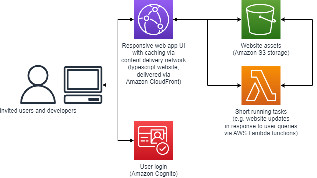

# jibe-vis
Interactive visualisation app for exploring health impacts of urban planning scenarios based on large-scale transport and health simulation modelling.



## Status
Preliminary draft (at time of writing, 7 May 2024)

## Requirements
This website is built using Node.js and the Node package manager (npm).  Project dependencies installed via npm are listed in `packages.json`.  [Node.js](https://nodejs.org/en/download) is required to install dependencies, and build and run the website locally.  With Node.js installed, to run the project locally,

1. Clone this repository
```
git clone https://github.com/jibeproject/jibe-vis.git
```

2. Install dependencies
```
npm install
```

3. Run the app
```
npm start
```

## Funding
We gratefully acknowledge funding and resources provided through the [RMIT AWS Supercomputing Hub (RACE Hub)](https://www.rmit.edu.au/partner/hubs/race) through grants RMAS00013 and CIC00014. 

## Provenance
This project was bootstrapped with [Create React App](https://github.com/facebook/create-react-app), and developed based on a series of AWS-related architecture design patterns:
- https://docs.aws.amazon.com/wellarchitected/latest/serverless-applications-lens/web-application.html
- https://docs.aws.amazon.com/prescriptive-guidance/latest/patterns/create-a-react-app-by-using-aws-amplify-and-add-authentication-with-amazon-cognito.html
- https://ui.docs.amplify.aws/react/connected-components/authenticator

## Available Scripts

In the project directory, you can run:

### `npm start`

Runs the app in the development mode.\
Open [http://localhost:3000](http://localhost:3000) to view it in your browser.

The page will reload when you make changes.\
You may also see any lint errors in the console.

### `npm test`

Launches the test runner in the interactive watch mode.\
See the section about [running tests](https://facebook.github.io/create-react-app/docs/running-tests) for more information.

### `npm run build`

Builds the app for production to the `build` folder.\
It correctly bundles React in production mode and optimizes the build for the best performance.

The build is minified and the filenames include the hashes.\
Your app is ready to be deployed!

See the section about [deployment](https://facebook.github.io/create-react-app/docs/deployment) for more information.

