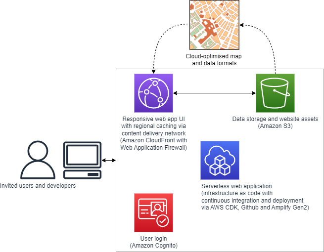

# Transport & Health Impacts (jibe-vis)
An interactive platform to inform healthy transport planning policy and localised infrastructure interventions, and visualise the impact pathways of modelled transportation scenarios.

## Brief

Through the JIBE project (Joining Impact models of transport with spatial measures of the Built Environment) and the associated AToM project ( Activity-based and agent-based Transport model of Melbourne), we have developed agent-based transport simulation models capable of depicting complex urban systems.  Agent-based models like JIBE model how street-level built environment exposures influence behaviour, accessibility and health with high spatial and demographic granularity. Forecasting travel itineraries, behaviours, exposures, and health for representative synthetic populations of individuals allows us to simulate a broad range of scenarios of interest to health and transport planners and advocates.

However, the extensive and detailed outputs produced by agent-based and complex systems models like JIBE can be overwhelming; a potential barrier to effective knowledge translation and impact.

Development of Transport & Health Impacts commenced in 2024 in collaboration with advocacy and government stakeholders as open source software on GitHub. Through iterative development and testing of new data stories and functionality we developed the platform to explore and test approaches for increasing engagement with transport modelling research and impact on policy and practice.

We engaged government and advocacy stakeholders and researchers to co-develop an interactive platform with two related aims:
1. To make complex urban systems modelling evidence accessible and useful for informing healthy transport planning policy and localised infrastructure interventions; and
2. Support visualising the impacts of modelled transportation scenarios.

The visualisation platform developed through this work has been published in this repository as open source code that can be extended or adapted by other researchers and practitioners for new settings for translation of research evidence into practice.

## Architecture



## Project structure

```
diagrams/ # Folder containing JIBE-Vis architecture and concept diagrams
app/ # Folder containing the JIBE-Vis web application
├── amplify/ # Folder containing AWS CDK and Amplify backend configuration
│   ├── auth/ # Definition for authentication backend
│   │   └── resource.tsx
│   ├── storage/ # Definition for your storage backend
│   │   └── resource.ts
|   ├── backend.ts # Orchestration of backend infrastructure
├── src/ # React framework UI code
│   ├── components/ # Definition of discrete UI components (e.g. navbar and map)
│   ├── App.tsx # UI code
│   ├── index.css # Styling for your app
│   └── index.tsx # Application entry point
├── package.json # Project metadata file describing dependencies and script running
└── tsconfig.json # Configuration of TypeScript code compilation
```

This project uses the NodeJS [create-react-app](https://create-react-app.dev/) template, using the [Vite build tool](https://vitejs.dev/guide/).  The application currently draws on [AWS Amplify](https://docs.amplify.aws/react/), a framework for streamlined development and deploying of fullstack web applications using AWS cloud infrastructure.  However infrastructure as code is mostly defined using AWS Cloud Development Kit (CDK), with exception of the Cognito authentication service.  The intention is to transition from the Amplify framework to use the more flexible CDK resources for defining cloud infrastructure.

## Requirements
This website is built using Node.js and the Node package manager (npm).  Project dependencies installed via npm are listed in `packages.json`.  [Node.js](https://nodejs.org/en/download) is required to install dependencies, and build and run the website locally.  With Node.js installed, to run the project locally,

1. Clone this repository
```
git clone https://github.com/jibeproject/jibe-vis.git
```

2. Install dependencies by running the following command within the jibe-vis/app folder
```
npm install
```

3. Run the app locally by running the following within the jibe-vis/app folder:
```
npm run dev
```

4. Compile and test TypeScript implementation before deploying
```
npm run build
```

The website at time of writing is set up to deploy as an Amplify Gen 2 application on push to Github; if build is successful, the updated website should be deployed.  Deployment can be monitored via the AWS Amplify console.  This approach has been convenient for rapid prototyping, but longer term we may want to rethink the CI/CD implementation and how the website is deployed, hosted and served.

## Funding
We gratefully acknowledge funding and resources provided through a 2023 VicHealth Impact Research Grant ([Developing tools for knowledge translation in transport and health modelling](https://www.vichealth.vic.gov.au/funding/impact-research-grants#2023-impact-research-grant-recipients-19356)), and through [RMIT Advanced Computing Ecosystem (RACE)](https://www.rmit.edu.au/partner/hubs/race) grants RMAS00013, CIC00014, 25-RMAS-R200053, and 26-RMAS-H100043. 

## Provenance
This project was bootstrapped with [Create React App](https://create-react-app.dev/), and developed based on a series of AWS-related architecture design patterns:
- https://docs.aws.amazon.com/wellarchitected/latest/serverless-applications-lens/web-application.html
- https://docs.aws.amazon.com/prescriptive-guidance/latest/patterns/create-a-react-app-by-using-aws-amplify-and-add-authentication-with-amazon-cognito.html
- https://ui.docs.amplify.aws/react/connected-components/authenticator


